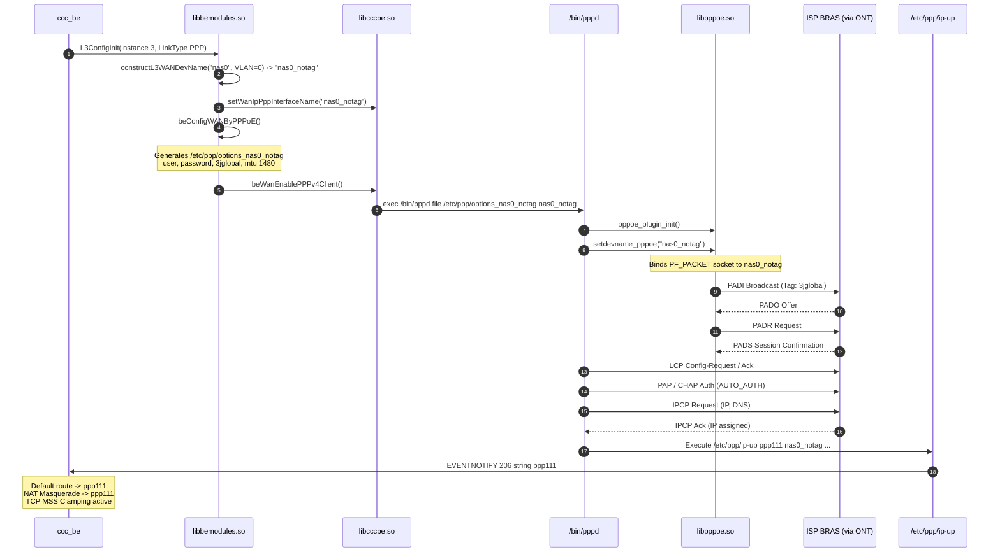

# PPPoE Subsystem Call Graph

## End-to-End Sequence & Call Flow

```mermaid
sequenceDiagram
    autonumber
    participant BE as ccc_be
    participant BEM as libbemodules.so
    participant CCCBE as libcccbe.so
    participant PPPD as /bin/pppd
    participant LIBPOE as libpppoe.so
    participant BRAS as ISP BRAS (via ONT)
    participant IPUP as /etc/ppp/ip-up

    BE->>BEM: L3ConfigInit(instance 3, LinkType PPP)
    BEM->>BEM: constructL3WANDevName("nas0", VLAN=0) -> "nas0_notag"
    BEM->>CCCBE: setWanIpPppInterfaceName("nas0_notag")
    BEM->>BEM: beConfigWANByPPPoE()
    Note over BEM: Generates /etc/ppp/options_nas0_notag<br/>user, password, 3jglobal, mtu 1480
    BEM->>CCCBE: beWanEnablePPPv4Client()
    CCCBE->>PPPD: exec /bin/pppd file /etc/ppp/options_nas0_notag nas0_notag
    PPPD->>LIBPOE: pppoe_plugin_init()
    PPPD->>LIBPOE: setdevname_pppoe("nas0_notag")
    Note over LIBPOE: Binds PF_PACKET socket to nas0_notag
    LIBPOE->>BRAS: PADI Broadcast (Tag: 3jglobal)
    BRAS-->>LIBPOE: PADO Offer
    LIBPOE->>BRAS: PADR Request
    BRAS-->>LIBPOE: PADS Session Confirmation
    PPPD->>BRAS: LCP Config-Request / Ack
    PPPD->>BRAS: PAP / CHAP Auth (AUTO_AUTH)
    PPPD->>BRAS: IPCP Request (IP, DNS)
    BRAS-->>PPPD: IPCP Ack (IP assigned)
    PPPD->>IPUP: Execute /etc/ppp/ip-up ppp111 nas0_notag ...
    IPUP->>BE: EVENTNOTIFY 206 string ppp111
    Note over BE: Default route -> ppp111<br/>NAT Masquerade -> ppp111<br/>TCP MSS Clamping active
```

